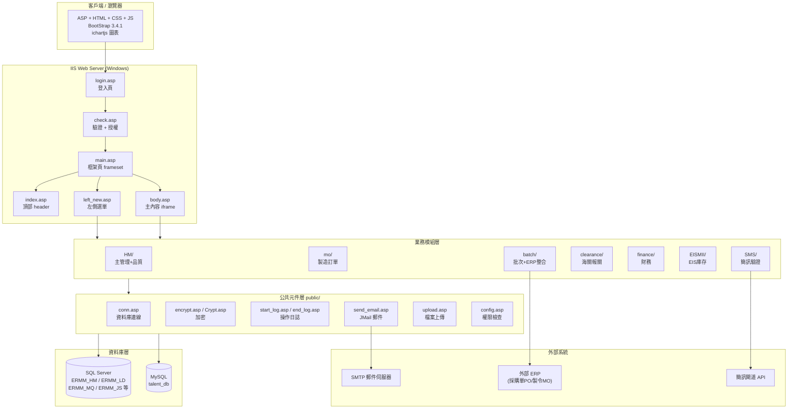
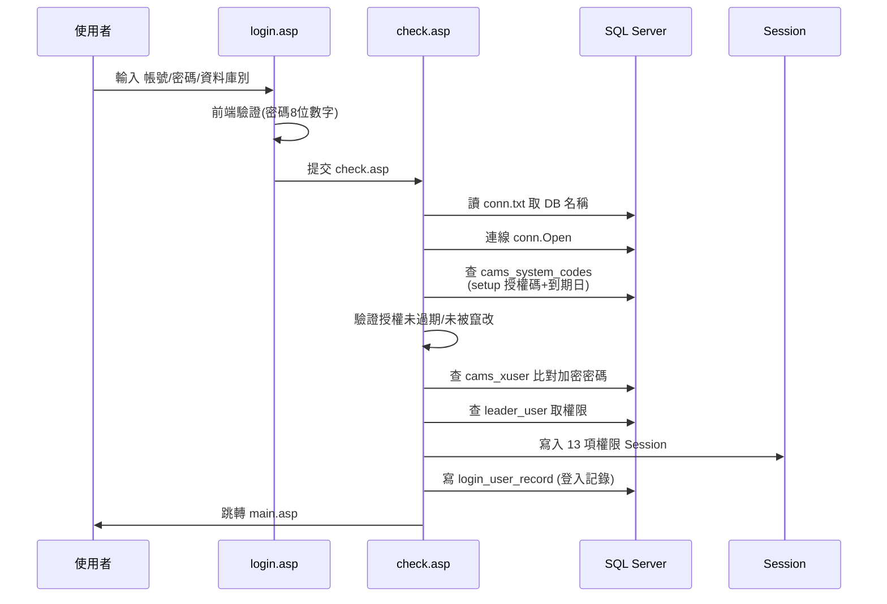
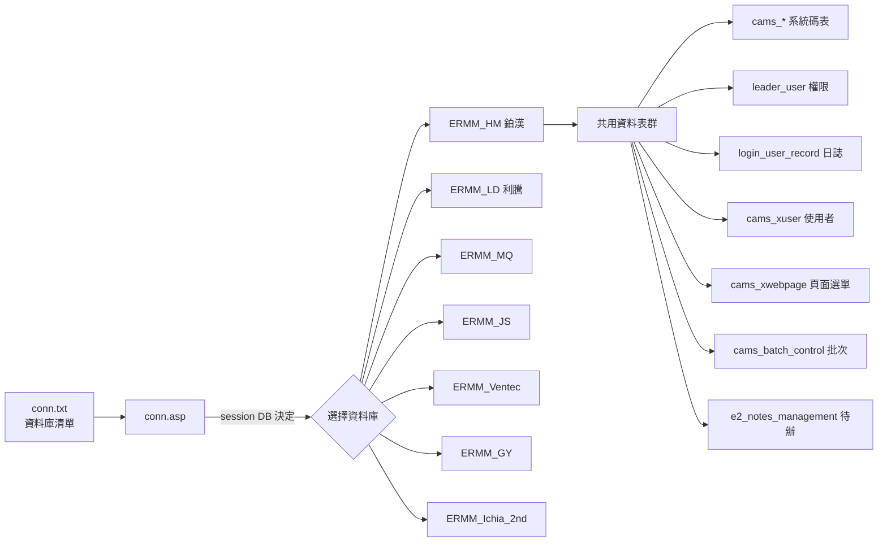
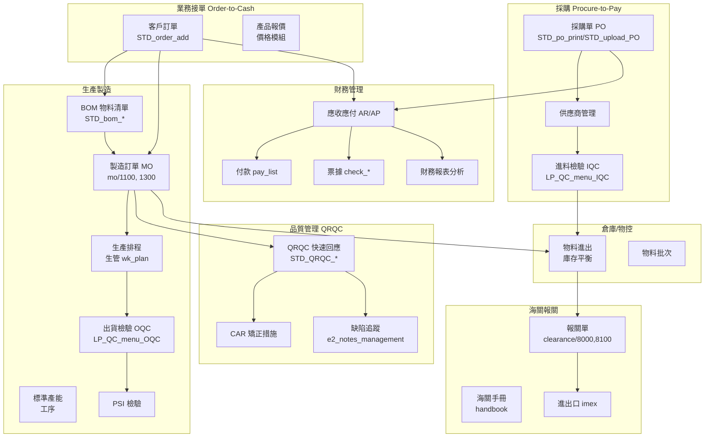
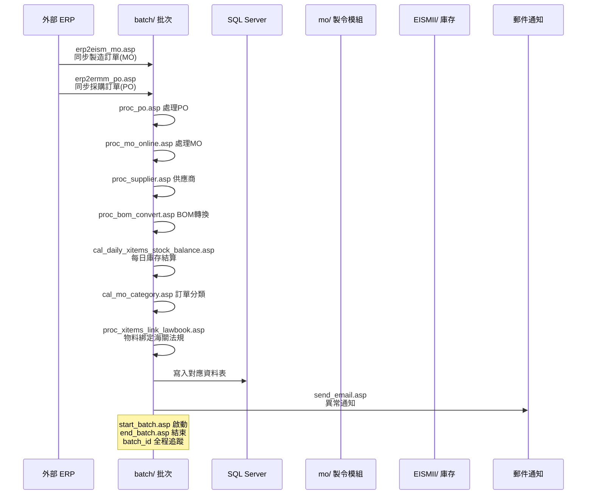
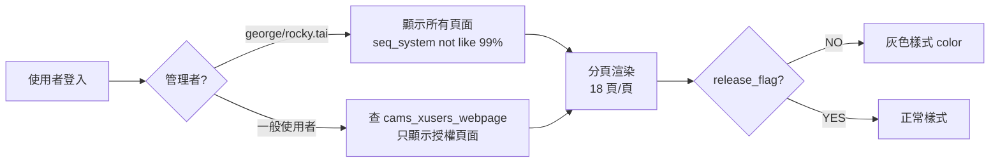
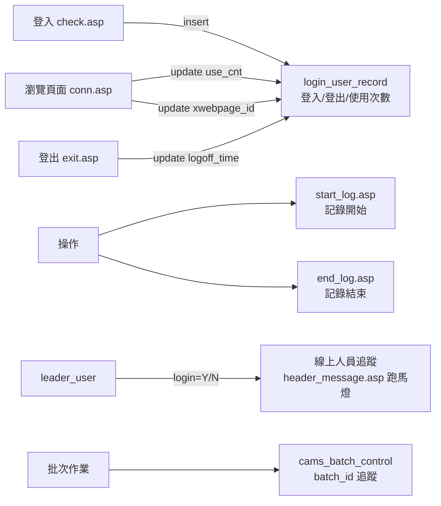
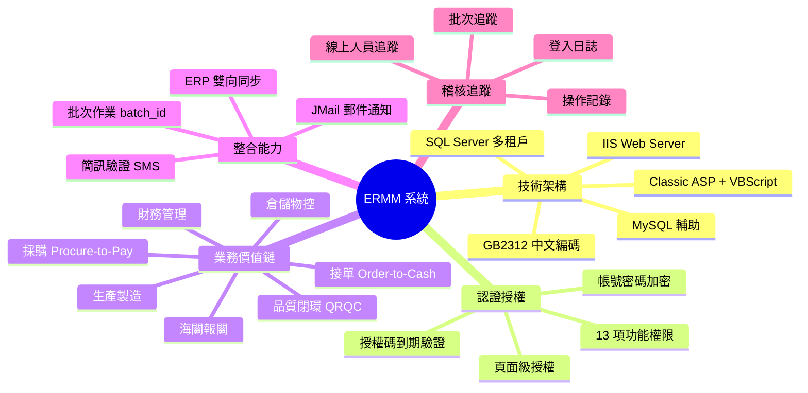

# ERMM 系統架構與流程圖說明

> 企業資源管理與製造系統 (Enterprise Resource Management & Manufacturing)
> 技術堆疊：Classic ASP (VBScript) + IIS + SQL Server + MySQL
> 編碼：CodePage=936 (GB2312 簡體中文)

---

## 目錄

1. [系統總體架構](#一系統總體架構)
2. [技術堆疊](#二技術堆疊)
3. [登入與權限流程](#三登入與權限流程)
4. [資料庫架構與多租戶切換](#四資料庫架構與多租戶切換)
5. [核心業務模組關係](#五核心業務模組關係)
6. [ERP 整合與批次作業流程](#六erp-整合與批次作業流程)
7. [頁面編碼體系](#七頁面編碼體系)
8. [日誌與稽核機制](#八日誌與稽核機制)
9. [整體關係總結](#九整體關係總結)

---

## 一、系統總體架構

### 架構分層說明

| 層級 | 元件 | 職責 |
|------|------|------|
| 客戶端 | 瀏覽器 | 渲染 ASP 輸出的 HTML/CSS/JS |
| Web 層 | IIS + ASP | 請求處理、VBScript 業務邏輯、frameset 框架頁 |
| 公共元件層 | `public/` 目錄 | 資料庫連線、加密、日誌、郵件、上傳、權限檢查 |
| 業務模組層 | HM/mo/batch/clearance/finance/EISMII/SMS | 各業務功能實現 |
| 資料庫層 | SQL Server (主) + MySQL (輔) | 資料持久化 |
| 外部系統 | ERP / SMTP / 簡訊閘道 | 資料同步與通知 |

---

## 二、技術堆疊

| 層級 | 技術 / 元件 | 說明 |
|------|-------------|------|
| 前端 | Classic ASP (VBScript)、HTML、CSS、JavaScript | CodePage=936 (GB2312 簡體中文) |
| UI 框架 | BootStrap 3.4.1 | 響應式樣式 |
| 圖表 | ichartjs | 質量/效率圖表 |
| Web 伺服器 | IIS + `web.config` | frameset 多框架頁結構 |
| 主資料庫 | Microsoft SQL Server | 多庫別切換，由 `conn.txt` 決定 |
| 輔助資料庫 | MySQL (ODBC 8.0) | `talent_db` |
| 加密 | 自製 `encrypt.asp` / `Crypt.asp` + `KeyGeN.asp` | 密碼加密、授權碼驗證 |
| 郵件 | JMail 元件 | `send_email.asp` 透過 SMTP 發送通知 |
| 檔案處理 | ADODB.Stream + FileSystemObject | Excel/BOM/PO 上傳匯入 |
| 字元編碼 | GB2312 ↔ Big5 轉換 | `gb2312tobig5.asp` 兩岸相容 |

---

## 三、登入與權限流程

### 驗證流程說明

1. **前端正規檢查** (`login.asp`)：密碼必須 8 位純數字；帳號密碼禁止 `' % < > & |` 等特殊字元。
2. **授權碼驗證** (`check.asp`)：查詢 `cams_system_codes` 中 `code_type='setup'`：
   - `value_date1` / `value_alpha1`：初始使用授權碼 + 加密校驗
   - `value_date2` / `value_alpha2`：終止使用授權碼 + 加密校驗
   - 任何授權碼被竄改 → 立即中止登入
3. **密碼比對**：`encrypt(password) <> cams_xuser.xuser_password`
4. **首次密碼強制變更**：密碼為 `12345678` 時跳轉 `modify_password.asp`。
5. **權限載入**：從 `leader_user` 表讀取 13 項功能權限寫入 Session。

### 權限模組（Session 變數）

| Session 變數 | 業務功能 | 說明 |
|--------------|----------|------|
| `procurement` | 採購 | 採購單、供應商 |
| `sales` | 業務 | 客戶訂單、報價 |
| `production` | 生產 | 製造訂單、生產日報 |
| `engineer` | 工程 | BOM、工序、模具 |
| `handbook` | 手冊 | 海關手冊 |
| `wk_plan` | 生管 | 生產排程 |
| `quality` | 品質 | QRQC、IQC/OQC |
| `document` | 文件 | 文件管理 |
| `price` | 價格 | 產品報價 |
| `stock` | 倉庫 | 物料進出、庫存 |
| `finance` | 財務 | AR/AP、付款 |
| `imex` | 進出口 | 報關、進出口 |
| `others` | 其他 | 其他功能 |
| `class` | 管理等級 | 決定管理者身份 |

---

## 四、資料庫架構與多租戶切換

### 多租戶設計

- 同一套程式碼，登入時選擇不同資料庫別（對應不同公司/廠區）
- `conn.txt` 列出 9 個資料庫別，實現「一套程式多公司部署」
- 各資料庫結構相同，資料獨立隔離

### 主要資料表群

| 資料表前綴/名稱 | 用途 |
|-----------------|------|
| `cams_xuser` | 使用者帳號、密碼(加密)、姓名、部門、客戶別 |
| `cams_xuser_xbu` | 使用者與業務單位(BU)關聯 |
| `cams_xusers_webpage` | 使用者與頁面授權關聯 |
| `cams_xwebpage` | 系統頁面註冊表(seq_system 編碼、URL、發布旗標) |
| `cams_system_codes` | 系統授權碼、郵件清單、批次控制 |
| `cams_global_codes` | 全域代碼(client_id、截止日期、批次控制) |
| `cams_batch_control` | 批次作業記錄(batch_id) |
| `leader_user` | 權限管理(12 項功能權限 + 管理旗標) |
| `login_user_record` | 登入日誌(登入/登出/使用次數/頁面記錄) |
| `e2_notes_management` | 品質異常待辦追蹤 |
| `MGM_QC_wkteam_details` | 品質小組任務分派 |

---

## 五、核心業務模組關係

### 業務流程說明

#### 1. 接單到收款 (Order-to-Cash)
客戶訂單 → BOM 展開 → 製令生產 → 出貨檢驗 → 應收帳款 → 收款/票據 → 財務分析

#### 2. 採購到付款 (Procure-to-Pay)
採購單 PO → 供應商管理 → 進料檢驗 IQC → 入庫 → 應付帳款 → 付款 → 票據管理

#### 3. 生產製造流程
BOM 物料清單 → 製造訂單 MO → 標準產能/工序 → 生產排程 → 生產日報 → 出貨檢驗 OQC/PSI

#### 4. 品質閉環
QRQC 快速回應 → CAR 矯正措施 → e2_notes_management 待辦追蹤 → header_message.asp 跑馬燈提醒 → 結案

#### 5. 報關與進出口
物料進出 → 海關手冊 → 報關單 → 進出口管理 → 財務入帳

---

## 六、ERP 整合與批次作業流程

### 批次作業模組 (batch/ 目錄)

| 檔案 | 功能 |
|------|------|
| `start_batch.asp` | 批次啟動，產生 batch_id |
| `end_batch.asp` | 批次結束 |
| `erp2eism_mo.asp` | 從 ERP 同步製造訂單 (MO) |
| `erp2ermm_po.asp` | 從 ERP 同步採購訂單 (PO) |
| `proc_po.asp` | 採購單處理 |
| `proc_mo_online.asp` | 線上製令處理 |
| `proc_supplier.asp` | 供應商資料處理 |
| `proc_bom_convert.asp` | BOM 產品結構轉換 |
| `cal_daily_xitems_stock_balance.asp` | 每日物料庫存平衡計算 |
| `cal_mo_category.asp` | 製令分類計算 |
| `proc_xitems_link_lawbook.asp` | 物料綁定海關法規 |
| `send_email.asp` | 批次異常郵件通知 |

### 批次控制機制

- `cams_batch_control` 記錄 batch_id 全程追蹤
- `cams_global_codes` 中關鍵截止代碼：
  - `BATCH_CONTROL`：批次控制日期
  - `CUSTOM_CUTOFF`：報關截止日
  - `MO_CUTOFF`：製令截止日
  - `INV_CUTOFF`：庫存截止日

---

## 七、頁面編碼體系

系統所有功能頁面由 `cams_xwebpage` 資料表統一註冊，以 `seq_system` 跨號分類：

| 跨號區段 | 業務領域 | 對應 document/ PDF |
|----------|----------|-------------------|
| 1000 系列 | 系統設定/首頁 | 1000~1050.pdf |
| 2000 系列 | 業務接單/報價 | 2000~2130.pdf |
| 3000 系列 | 採購/物料 | 3000~3072.pdf |
| 5000 系列 | 生產製造/庫存 | 5000~5030.pdf |
| 8000 系列 | 海關報關/進出口 | 8000~8070.pdf |
| 8500 系列 | 財務管理 | 8500~8530.pdf |

### 動態選單機制 (left_new.asp)

- 管理者：顯示所有 `seq_system not like '99%'` 且 `test_only='F'` 頁面
- 一般使用者：透過 `cams_xusers_webpage` 關聯表只顯示授權頁面
- `release_flag=NO` 標記未正式發布頁面（灰色顯示）
- 分頁顯示，每頁 18 個功能按鈕

---

## 八、日誌與稽核機制

### 稽核機制說明

1. **登入日誌** (`login_user_record`)：記錄每次登入時間、使用次數、當前瀏覽頁面、登出時間
2. **線上人員追蹤**：`leader_user.login='Y'` 標記線上狀態，`header_message.asp` 跑馬燈顯示線上人員清單
3. **自動登出**：跨日登入狀態自動清除（`header_message.asp` 檢查 `diff_time > 0`）
4. **操作記錄**：`start_log.asp` / `end_log.asp` 記錄各操作開始與結束時間
5. **批次追蹤**：`cams_batch_control` 的 batch_id 貫穿整個批次作業流程

---

## 九、整體關係總結

### 七大核心特徵

1. **單一入口框架**：`login.asp → check.asp → main.asp(frameset)` 統一入口，頂部 `index.asp` 顯示公司/時間/登出，左側 `left_new.asp` 動態選單，主內容 `body.asp` iframe。

2. **權限雙層控制**：`cams_xuser`(帳號密碼) + `leader_user`(13 項功能權限) + `cams_xusers_webpage`(頁面級授權)，形成三層權限體系。

3. **多租戶架構**：一套程式碼，登入時選 DB 切換公司，`conn.txt` 列出 9 個資料庫別（鉑漢/利騰/Ventec/Ichia 等），各廠區資料獨立隔離。

4. **ERP 雙向整合**：`batch/` 目錄從 ERP 同步 PO/MO/BOM/供應商，並計算庫存平衡、訂單分類、物料報關法規綁定，以 `batch_id` 全程追蹤。

5. **品質閉環**：QRQC 快速回應 → CAR 矯正 → `e2_notes_management` 待辦追蹤 → `header_message.asp` 跑馬燈提醒，形成品質異常追蹤閉環。

6. **報關財務一體**：物料進出 → 海關手冊/報關單 → 應收應付(AR/AP) → 付款/票據 → 財務分析，整合進出口(imex)與財務(finance)模組。

7. **稽核完整**：`login_user_record` 記錄每次登入/使用/登出，`cams_batch_control` 追蹤批次作業，`start_log/end_log` 記錄操作歷程，`leader_user` 追蹤線上人員。

---

## 附錄：關鍵檔案索引

| 檔案路徑 | 功能 |
|----------|------|
| `login.asp` | 登入頁 |
| `check.asp` | 登入驗證 + 授權碼檢查 + 權限載入 |
| `main.asp` | frameset 主框架 (頂部+左側+主內容) |
| `index.asp` | 頂部 header (公司/時間/登出) |
| `left_new.asp` | 左側動態選單 (依權限渲染) |
| `body.asp` | 主內容 iframe 容器 |
| `exit.asp` | 登出 (清除 login 狀態 + 記錄 logoff) |
| `public/conn.asp` | 主資料庫連線 (依 session DB) |
| `public/encrypt.asp` | 密碼加密函式 |
| `public/send_email.asp` | JMail 郵件發送 |
| `public/start_log.asp` | 操作開始日誌 |
| `public/end_log.asp` | 操作結束日誌 |
| `public/upload.asp` | 檔案上傳 |
| `conn.txt` | 資料庫別清單 (9 個) |
| `web.config` | IIS 設定 |
| `setup/setup.asp` | 系統初始化設定 |
| `HM/` | 主管理 + 品質控制模組 |
| `mo/` | 製造訂單模組 (1100/1300 系列) |
| `batch/` | 批次作業 + ERP 整合 |
| `clearance/` | 海關報關模組 (8000/8100) |
| `finance/` | 財務管理模組 |
| `EISMII/` | EIS 庫存管理模組 |
| `SMS/` | 簡訊驗證模組 |

---

*文件版本：1.0  
生成日期：2026-09-02  
系統：ERMM (Enterprise Resource Management & Manufacturing)*
