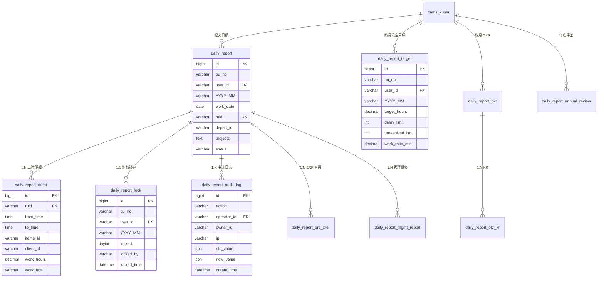
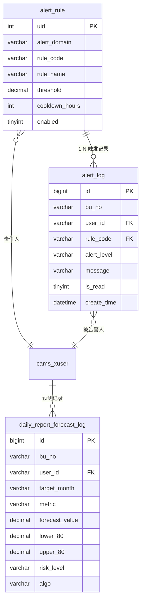
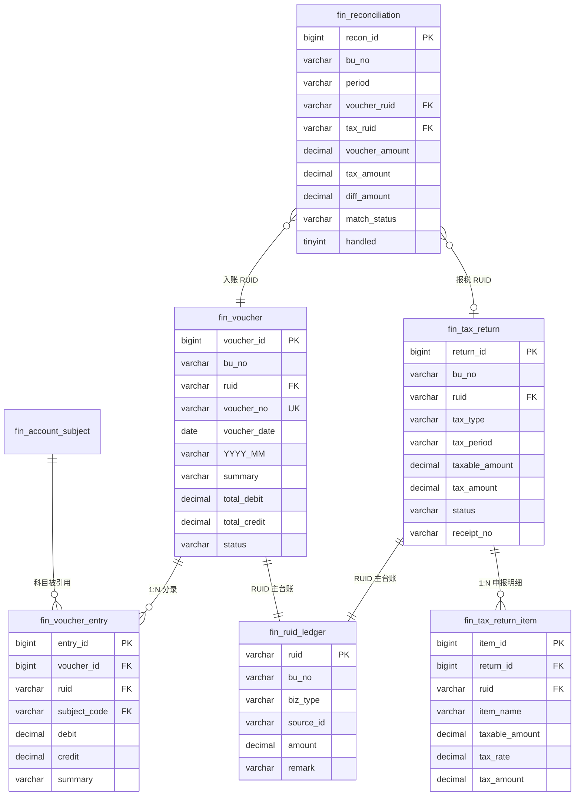
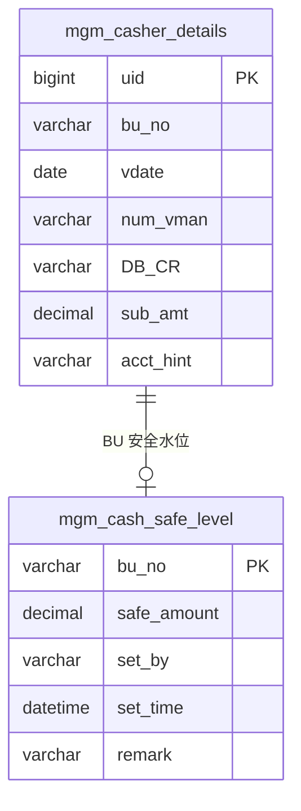
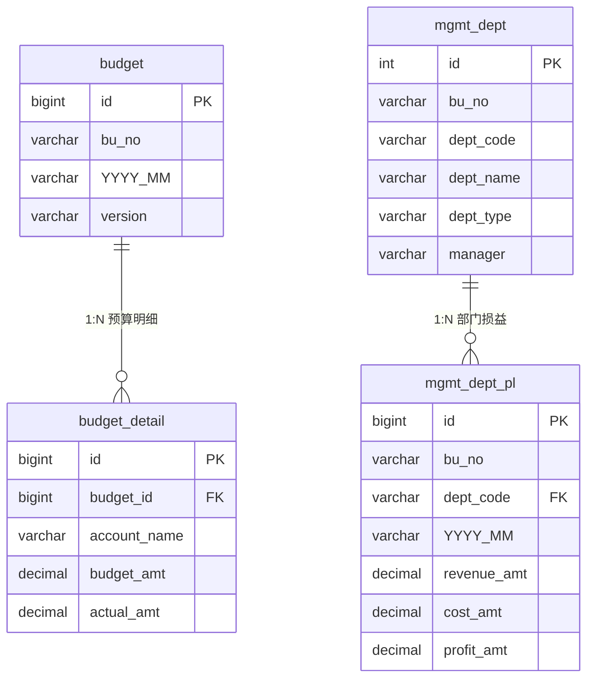
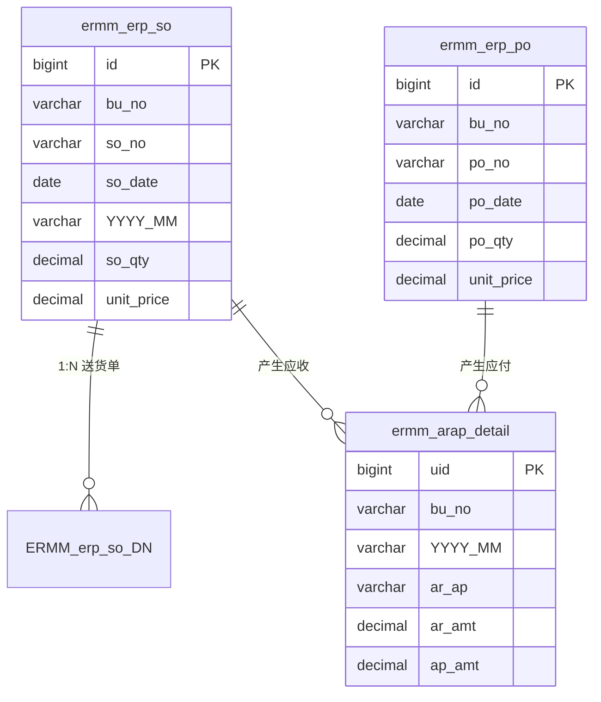
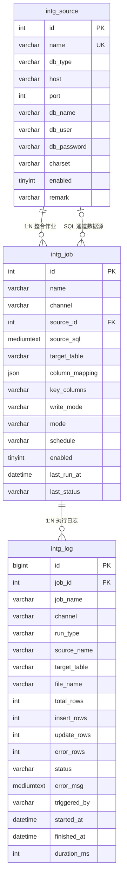
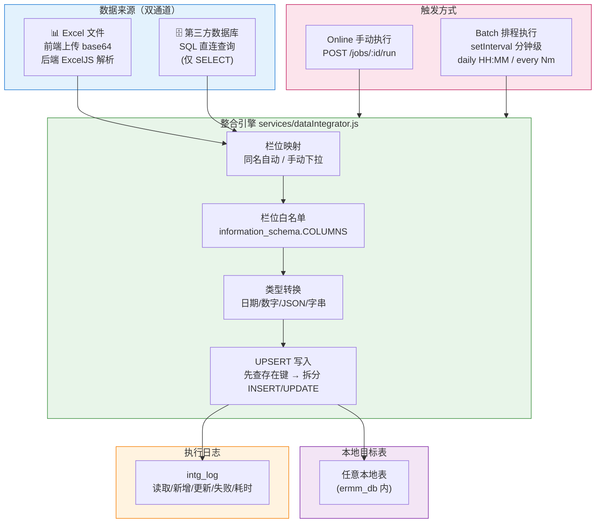
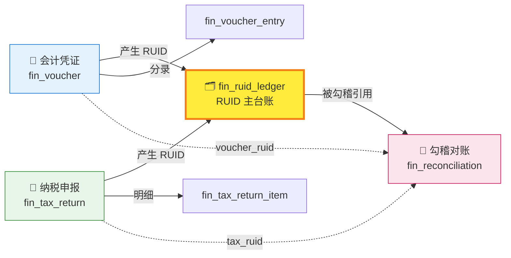

# ERMM 财务模组 · 系统架构图与模块-资料表关系图

> 基于代码事实抽取（routes/*.js、database/add_*.js、public/index.html 菜单、public/js/pages/*.js）
> 生成日期：2026-10-06｜更新日期：2026-10-09（补充第三方资料整合模块）

---

## 一、系统整体架构图（分层架构）

```mermaid
flowchart TB
    subgraph CLIENT["① 客户端层"]
        Browser["浏览器 (Chrome/Edge)<br/>HTTP + JWT"]
    end

    subgraph FRONTEND["② 前端 SPA 层 (public/)"]
        Index["index.html 入口<br/>+ 侧边栏菜单 (43 页)"]
        App["app.js<br/>路由/导航/弹窗/通用 UI"]
        I18n["i18n.js<br/>简/繁/英 三语"]
        Pages["pages/*.js (40 个功能页)<br/>dashboard / dailyReport / finance / integration / ..."]
        Chart["Chart.js 图表引擎"]
    end

    subgraph GATEWAY["③ API 网关层 (app.js)"]
        Auth["/api/auth<br/>登录/登出/JWT"]
        AuthReq["authRequired 中间件<br/>JWT 校验 + 权限"]
        Static["静态资源服务<br/>public/"]
    end

    subgraph SERVICE["④ 业务服务层 (routes/*.js · 41 个路由)"]
        direction LR
        S1["📊 绩效闭环<br/>dailyReport"]
        S2["🔔 预警引擎<br/>alert"]
        S3["📈 趋势预测<br/>forecast"]
        S4["📒 财务核心<br/>finance"]
        S5["💰 现金预测<br/>cashForecast"]
        S6["🧾 财务核算<br/>cash/invoice/pay/check/bank/account"]
        S7["📋 预算/管会/合并<br/>budget/mgmtAccounting/consolidation"]
        S8["🤖 AI 能力<br/>aiqa/llm/diagnosis"]
        S9["📦 业务单据<br/>po/so/dn/tempPo"]
        S10["⚙️ 系统支撑<br/>system/user/batch/kpi/action"]
        S11["🔌 第三方资料整合<br/>integration"]
    end

    subgraph DATA["⑤ 数据层 (MySQL 8 · ermm_db)"]
        direction TB
        CoreT["核心交易表<br/>daily_report / fin_voucher / fin_tax_return / ..."]
        AuditT["审计与配置表<br/>daily_report_audit_log / alert_rule / llm_config / ..."]
        BaseT["基础资料表<br/>cams_xuser / mgm_account_details / mgmt_dept / ..."]
        Ledger["fin_ruid_ledger<br/>RUID 全链路主台账"]
        IntgT["第三方整合表<br/>intg_source / intg_job / intg_log"]
    end

    subgraph EXTERNAL["⑥ 外部/支撑"]
        LLM["LLM 服务<br/>(AI 问答/诊断)"]
        Mailer["邮件服务<br/>nodemailer 告警通知"]
        Scheduler["node-cron 排程器<br/>工作日 09:30/16:30 告警扫描"]
        ThirdPartyDB["第三方数据库<br/>(MySQL 连线池缓存)"]
        ExcelFile["Excel 文件<br/>(ExcelJS 解析/导入)"]
        IntgSched["整合排程器<br/>(setInterval 分钟级)"]
    end

    Browser --> Index
    Index --> App --> Pages --> Chart
    App --> Auth --> AuthReq
    AuthReq --> S1 & S2 & S3 & S4 & S5 & S6 & S7 & S8 & S9 & S10 & S11
    S1 --> CoreT & AuditT
    S2 --> AuditT & Scheduler --> Mailer
    S3 --> CoreT
    S4 --> Ledger & CoreT
    S5 --> CoreT
    S6 --> CoreT
    S7 --> CoreT
    S8 --> LLM & CoreT
    S9 --> CoreT
    S10 --> BaseT & AuditT
    S11 --> IntgT & CoreT
    S11 --> ThirdPartyDB & ExcelFile & IntgSched
    Ledger --> CoreT

    style CLIENT fill:#e3f2fd,stroke:#1976d2
    style FRONTEND fill:#e8f5e9,stroke:#388e3c
    style GATEWAY fill:#fff3e0,stroke:#f57c00
    style SERVICE fill:#fce4ec,stroke:#c2185b
    style DATA fill:#f3e5f5,stroke:#7b1fa2
    style EXTERNAL fill:#efebe9,stroke:#5d4037
```



---

## 二、模块 → 路由 → 前端页 → 资料表 关系总表

> 每张表归属于「主要操作模块」；跨模块共用表在说明列标注。

| # | 功能模块 | API 路由 | 前端页面 | 主要资料表 | 说明 |
|---|---|---|---|---|---|
| 1 | **认证授权** | `/api/auth` | login | `cams_xuser` `login_user_record` `leader_user` | JWT 签发、登录日志 |
| 2 | **系统管理** | `/api/system` | system | `cams_system_codes` `schema_migrations` | 系统码、迁移版本 |
| 3 | **用户管理** | `/api/user` | user | `cams_xuser` | 用户/部门/角色维护 |
| 4 | **工作日报表** | `/api/daily-report` | dailyReport | `daily_report` `daily_report_detail` `daily_report_lock` `daily_report_audit_log` `daily_report_target` `daily_report_okr` `daily_report_okr_kr` `daily_report_erp_xref` `daily_report_mgmt_report` `daily_report_annual_review` `cams_xuser` | **核心模块**：日报主表+10 张支撑表 |
| 5 | **未完成分析** | `/api/daily-report` | dailyReportUnfinished | `daily_report` `daily_report_detail` | 基于日报明细统计延误/未解 |
| 6 | **预警通知** | `/api/alert` | alerts | `alert_rule` `alert_log` | 5 条内置告警规则 + 告警记录 |
| 7 | **趋势预测** | `/api/forecast` | trend | `daily_report_forecast_log` `daily_report` | WMA+LR 混合预测，结果落库 |
| 8 | **行动追踪** | `/api/action` | actions | `action_task` | 行动项追踪 |
| 9 | **财务入账/报税/勾稽** | `/api/finance` | finance | `fin_ruid_ledger` `fin_account_subject` `fin_voucher` `fin_voucher_entry` `fin_tax_return` `fin_tax_return_item` `fin_reconciliation` | **RUID 全链路**：7 张表 |
| 9a | **报税明细表（年度汇总+导出）** | `/api/finance/tax-detail` | finance（报税 Tab） | `fin_tax_return` `fin_tax_return_item` | **只读聚合**：JOIN 报税主表+明细，年度汇总，支持 CSV 导出，无新增表 |
| 10 | **现金流量预测** | `/api/cash-forecast` | cashForecast | `mgm_casher_details` `mgm_cash_safe_level` | 13 周预测 + 安全水位 |
| 11 | **现金日记账** | `/api/cash` | cash | `mgm_casher_details` | 与现金预测共用 casher 表 |
| 12 | **应收应付** | `/api/arap` | arap | `ermm_arap_detail` `ermm_erp_so` `ermm_erp_po` | 关联 SO/PO 自动产生 AR/AP |
| 13 | **发票管理** | `/api/invoice` | invoice | `mgm_invoice_details` | 销项/进项发票 |
| 14 | **付款明细** | `/api/pay` | pay | `pay_detail` | 付款流水 |
| 15 | **票据管理** | `/api/check` | check | `check_detail` | 应收/应付票据 |
| 16 | **银行贷款** | `/api/bank` | bank | `mgm_bank_loan_details` | 贷款本金/利息 |
| 17 | **会计科目** | `/api/account` | account | `mgm_account_details` `MGM_account_details` | 科目余额（与 finance.fin_account_subject 互补） |
| 18 | **预算编制** | `/api/budget` | budget | `budget` `budget_detail` | 预算主表+明细 |
| 19 | **管理会计** | `/api/mgmt-accounting` | mgmtAccounting | `mgmt_dept` `mgmt_dept_pl` | 部门损益 |
| 20 | **合并报表** | `/api/consolidation` | consolidation | `mgm_finance_summary` `mgmt_dept_pl` | 多 BU 合并 |
| 21 | **财务摘要** | `/api/summary` | summary | `mgm_finance_summary` | 月度财务摘要 |
| 22 | **三大报表** | `/api/report` | report | `mgm_finance_summary` | 资产负债/利润/现金流量 |
| 23 | **风险预警** | `/api/risk` | risk | `mgm_finance_summary` `ermm_arap_detail` | 财务风险指标 |
| 24 | **财务预测** | `/api/forecast` | forecast | `forecast_detail` | 财务数据预测 |
| 25 | **年度趋势** | `/api/forecast` | trend | `mgm_finance_summary` `forecast_detail` | 年度趋势图表 |
| 26 | **月度报表** | `/api/monthly` | monthly | `monthly_items` | 月度项目 |
| 27 | **损益平衡** | `/api/bep` | bep | `mgm_bep_threshold` | BEP 阈值 |
| 28 | **AI 问答** | `/api/aiqa` | aiqa | `ermm_ai_records` `llm_config` `mgm_finance_summary` `budget_detail` `mgmt_dept_pl` | AI 对话记录+配置 |
| 29 | **情景模拟** | `/api/scenario` | scenario | `budget_detail` `mgm_finance_summary` | 多情景测算 |
| 30 | **异常诊断** | `/api/diagnosis` | (内嵌) | `mgm_finance_summary` `mgm_kpi_desc` | KPI 异常自动诊断 |
| 31 | **采购单 PO** | `/api/po` | po | `ermm_erp_po` | 采购订单 |
| 32 | **销售订单 SO** | `/api/so` | so | `ermm_erp_so` | 销售订单 |
| 33 | **送货单 DN** | `/api/dn` | dn | `ERMM_erp_so_DN` `ermm_erp_so` | 送货通知 |
| 34 | **PO 暂存** | `/api/temp-po` | tempPo | `ermm_temp_po` | PO 暂存草稿 |
| 35 | **分公司** | `/api/branch` | branch | `branch_detail` | 分公司资料 |
| 36 | **往来关系** | `/api/relation` | relation | `relation_detail` | 客户/供应商关系 |
| 37 | **批次管控** | `/api/batch` `/api/batch-ctrl` | batch | `cams_batch_control` | 批次控制 |
| 38 | **KPI 管理** | `/api/kpi` `/api/kpi-query` | kpi | `mgm_kpi_desc` `mgm_finance_summary` | KPI 定义与查询 |
| 39 | **多维下钻** | `/api/kpi-query` | drilldown | `mgm_finance_summary` `ermm_erp_so` `mgm_invoice_details` | 多维度数据下钻 |
| 40 | **存货管理** | `/api/xitems` | xitems | `e2_xitems_daily_status` `e2_xitems_daily_status_chart` | 存货日状态 |
| 41 | **仪表板** | `/api/summary` `/api/daily-report` | dashboard | 跨模块聚合 | 首页汇总（日报+财务） |
| 42 | **第三方资料整合** | `/api/integration` | integration | `intg_source` `intg_job` `intg_log` + 任意本地目标表 | **双通道**：Excel 导入 / SQL 直连第三方库；Online 即时 / Batch 排程；栏位映射 + UPSERT + 栏位白名单 |

---

## 三、核心模块资料表关系图（ER 图）

### 3.1 工作日报表模块（P0/P1 核心）



---

### 3.2 预警与预测模块（M3）



---

### 3.3 财务入账 / 报税 / 勾稽模块（RUID 全链路）

> `fin_ruid_ledger` 为全链路中樞，凭证、报税、勾稽均通过 RUID 回指主台账。



---

### 3.4 报税明细表模块（年度汇总 + CSV 导出）

> **模块性质**：只读聚合查询 + 前端导出，**不新增资料表**，复用 `fin_tax_return` 与 `fin_tax_return_item`。

#### 3.4.1 数据流


#### 3.4.2 SQL 关联口径（来自 routes/finance.js L251-318）

```sql
SELECT r.return_id, r.ruid, r.tax_type, r.tax_period, r.status,
       r.taxable_amount AS return_taxable, r.tax_amount   AS return_tax,
       r.receipt_no, r.filed_time,
       i.item_name, i.subject_code,
       i.taxable_amount AS item_taxable, i.tax_rate, i.tax_amount AS item_tax
FROM fin_tax_return r
LEFT JOIN fin_tax_return_item i ON i.return_id = r.return_id
WHERE r.bu_no = ? AND r.tax_period LIKE '2025/%'
ORDER BY r.tax_period, r.return_id, i.item_id;
```

| 关联项 | 说明 |
|---|---|
| 主表 | `fin_tax_return`（r）— 每笔申报 1 行 |
| 子表 | `fin_tax_return_item`（i）— 每笔申报 N 条明细 |
| JOIN 键 | `i.return_id = r.return_id`（LEFT JOIN，无明细的申报也保留） |
| 期间过滤 | `r.tax_period LIKE '{year}/%'`（精确到年） |
| 排序 | 期间 → return_id → item_id |

#### 3.4.3 字段级数据字典（API 返回结构）

**顶层返回对象**：

| 字段 | 类型 | 来源 | 说明 |
|---|---|---|---|
| `bu_no` | string | 请求参数 | 公司别 |
| `year` | string | 请求参数 | 年度（如 2025） |
| `generated_at` | string(ISO) | 后端 `new Date()` | 生成时间戳 |
| `return_count` | int | `returnsMap.size` | 该年度申报表笔数（去重） |
| `item_count` | int | `details.length` | 明细行数 |
| `summary.by_type` | object | 按 `tax_type` 聚合 | 各税种小计 |
| `summary.total_taxable` | decimal | Σ return_taxable（按 return_id 去重） | 全年应税合计 |
| `summary.total_tax` | decimal | Σ return_tax（按 return_id 去重） | 全年税额合计 |

**`summary.by_type.{tax_type}` 子对象**：

| 字段 | 类型 | 计算方式 | 说明 |
|---|---|---|---|
| `tax_name` | string | 映射表 `{VAT:'增值税', IT:'企业所得税', ST:'印花税'}` | 税种中文名 |
| `taxable` | decimal | Σ `fin_tax_return.taxable_amount`（同税种） | 该税种应税合计 |
| `tax` | decimal | Σ `fin_tax_return.tax_amount`（同税种） | 该税种税额合计 |
| `count` | int | 该税种申报表行数 | 笔数 |

**`details[]` 数组元素**（每行对应一条 `fin_tax_return_item`，无明细时用主表值兜底）：

| 字段 | 类型 | 取值来源 | 说明 |
|---|---|---|---|
| `return_id` | bigint | `r.return_id` | 申报表主键 |
| `ruid` | varchar | `r.ruid` | 报税 RUID（关联 fin_ruid_ledger） |
| `tax_type` | varchar | `r.tax_type` | 税种代码 VAT/IT/ST |
| `tax_name` | string | 映射表 | 税种中文名 |
| `tax_period` | varchar | `r.tax_period` | 课税期间（如 2025/01） |
| `status` | varchar | `r.status` | CALCULATED/APPROVED/FILED |
| `receipt_no` | varchar | `r.receipt_no` | 税务回执号（FILED 后有值） |
| `filed_time` | datetime | `r.filed_time` | 申报时间 |
| `subject_code` | varchar | `i.subject_code` | 明细科目代码（可空） |
| `item_name` | varchar | `i.item_name` | 明细项目名 |
| `taxable_amount` | decimal | `COALESCE(i.taxable_amount, r.taxable_amount, 0)` | 应税金额（明细优先，无明细取主表） |
| `tax_rate` | decimal | `i.tax_rate` | 税率（如 0.13） |
| `tax_amount` | decimal | `COALESCE(i.tax_amount, r.tax_amount, 0)` | 税额（明细优先） |

**⚠️ 关键计算规则**（避免多明细行重复计算全年合计）：
- 全年应税/税额合计 = 按 `return_id` 去重后再 Σ，**不是**直接 SUM 所有明细行（一张申报若有 N 条明细，直接 SUM 会重复 N 次主表金额）。
- 实现：用 `Map<return_id, {taxable, tax, type}>` 去重后再聚合。

#### 3.4.4 页面字段映射表（弹窗明细表 9 列）

| 页面列 | 对应 API 字段 | 显示格式 |
|---|---|---|
| 期间 | `tax_period` | 原值（2025/01） |
| 税种 | `tax_name` | 中文名 |
| 项目 | `item_name` | 空值显示 `—` |
| RUID | `ruid` | 11px 灰色字体 |
| 应税金额 | `taxable_amount` | `UI.fmt(x, 2)` 右对齐 |
| 税率 | `tax_rate` | `(rate×100).toFixed(2) + '%'` 右对齐 |
| 税额 | `tax_amount` | `UI.fmt(x, 2)` 右对齐，加粗 |
| 状态 | `status` | 彩色徽章（FILED 绿/CALCULATED 蓝/APPROVED 橙） |
| 回执号 | `receipt_no` | 空值显示 `—` |

#### 3.4.5 CSV 导出格式

| 项目 | 内容 |
|---|---|
| 文件名 | `报税明细表_{bu_no}_{year}.csv`（如 `报税明细表_HM_2025.csv`） |
| 编码 | UTF-8 + BOM（`\uFEFF`），Excel 打开不乱码 |
| 换行 | `\r\n`（Windows 兼容） |
| 转义 | 含逗号/引号/换行的字段用双引号包裹，内部引号转义为 `""` |
| 内容结构 | 标题行 → 生成时间 → 空行 → 表头（9 列）→ 全部明细行 → 空行 → 各税种小计 → 全年合计 |

---

### 3.5 现金流模块



---

### 3.5 预算 / 管理会计 / 合并模块



---

### 3.6 业务单据模块（PO/SO/DN）



---

### 3.8 第三方资料整合模块（Excel 导入 / SQL 直连 · Online + Batch）

> **模块性质**：支持从 Excel 文件导入或 SQL 直连第三方数据库，将资料写入本地任意目标表；支持 Online 即时执行与 Batch 排程自动执行。引擎统一走 `services/dataIntegrator.js`，核心包含栏位白名单、类型转换、UPSERT（先查存在键→拆分 INSERT/UPDATE）。

#### 3.8.1 资料表 ER 图



#### 3.8.2 整合引擎数据流



#### 3.8.3 API 端点清单（routes/integration.js）

| 分组 | 方法 | 路径 | 说明 |
|---|---|---|---|
| 本地表结构 | GET | `/api/integration/tables` | 列出本地所有表 |
| 本地表结构 | GET | `/api/integration/tables/:name/columns` | 查询指定表的栏位定义 |
| 数据源 | GET | `/api/integration/sources` | 列出所有第三方数据源 |
| 数据源 | POST | `/api/integration/sources` | 新建数据源连线 |
| 数据源 | PUT | `/api/integration/sources/:id` | 更新数据源 |
| 数据源 | DELETE | `/api/integration/sources/:id` | 删除数据源（含关闭连线池） |
| 数据源 | POST | `/api/integration/sources/:id/test` | 测试已存数据源连线 |
| 数据源 | POST | `/api/integration/sources-test` | 测试未存数据源连线（预检） |
| 数据源 | POST | `/api/integration/sources/query` | SQL 预览（前 100 行） |
| 作业 | GET | `/api/integration/jobs` | 列出所有整合作业 |
| 作业 | POST | `/api/integration/jobs` | 新建作业 |
| 作业 | PUT | `/api/integration/jobs/:id` | 更新作业 |
| 作业 | DELETE | `/api/integration/jobs/:id` | 删除作业 |
| 作业 | POST | `/api/integration/jobs/:id/run` | 立即执行作业（Online） |
| Excel | POST | `/api/integration/excel/parse` | Excel base64 解析（预览前 5 行 + total_rows） |
| Excel | POST | `/api/integration/excel/import` | Excel 导入写入本地表 |
| 日志 | GET | `/api/integration/logs` | 查询执行日志 |

#### 3.8.4 前端 5 Tab 页面结构

| Tab | 标题 | 功能 |
|---|---|---|
| 1 | 📊 Excel 导入 | 选目标表 → 上传 .xlsx → 解析 Sheet → 栏位映射（同名自动映射）→ 预览 → 写入 |
| 2 | 🔌 SQL 线上整合 | 选数据源 → 输入 SQL → 测试读取 → 栏位映射 → 立即执行 / 存为批次作业 |
| 3 | ⏰ 批次作业 | 作业列表 → 启用/停用 → 编辑 → 立即执行 |
| 4 | 🗄️ 数据源 | 数据源 CRUD → 连线测试 |
| 5 | 📜 执行日志 | 日志查询（含 SQL + Excel 两通道记录） |

#### 3.8.5 关键技术要点

| 要点 | 说明 |
|---|---|
| **栏位白名单** | 从 `information_schema.COLUMNS` 读取目标表全部栏位，只允许映射到存在的栏（防注入） |
| **类型转换** | Excel serial 日期 → JS Date → 日期字串；千分位数字 → Number；空字串 → NULL；JSON 字串 → 对象 |
| **UPSERT 策略** | 统一走「先 SELECT 已存在键 → 拆分 INSERT / UPDATE」，避免 MySQL `ON DUPLICATE KEY` 的 affectedRows 在「值未变」时为 0 导致统计偏差 |
| **SQL 安全** | 仅允许单 SELECT（正则校验 `^\s*select`）、禁多语句（`/;\s*\S/`）、包成子查询加 LIMIT |
| **批次大小** | BATCH_SIZE=200，大批量资料分批写入 |
| **排程器** | 零依赖分钟级 `setInterval`，支持 `daily HH:MM` / `every Nm`，防重入（`ticking` 标志 + `runningJobs` Set） + 防重复触发（`firedKeys` Set） |
| **连接池缓存** | 第三方连接池按 `sourceId` 缓存于 `sourcePools` Map，复用连线避免反复握手 |

---

## 四、RUID 全链路追溯图（财务核心）



**追溯示例**：
- 已知报税回执号 `RXHM20250101` → 查 `fin_tax_return` 得 RUID → 查 `fin_ruid_ledger` 确认 → 查 `fin_reconciliation` 找到匹配的入账凭证 RUID → 查 `fin_voucher` + `fin_voucher_entry` 看到完整分录。

---

## 五、跨模块共用资料表

| 资料表 | 被哪些模块共用 |
|---|---|
| `cams_xuser` | 认证、用户、日报、预警、预测（几乎所有涉及"人"的模块） |
| `mgm_finance_summary` | 摘要、三大报表、风险、年度趋势、AI 问答、异常诊断、多维下钻 |
| `mgm_casher_details` | 现金日记账、现金流量预测 |
| `ermm_erp_so` | 销售订单、应收应付、送货单、多维下钻、日报经营数据 |
| `ermm_erp_po` | 采购单、应收应付、PO 暂存、日报经营数据 |
| `mgm_invoice_details` | 发票、财务分析、多维下钻、日报经营数据 |
| `budget_detail` | 预算编制、情景模拟、AI 问答 |
| `mgmt_dept_pl` | 管理会计、合并报表、AI 问答 |
| `mgmt_dept` | 管理会计、合并报表、日报部门维度 |
| **任意本地表** | 第三方资料整合模块可通过栏位映射写入 `ermm_db` 内的任意目标表（按栏位白名单约束） |

---

## 六、技术栈汇总

| 层 | 技术 |
|---|---|
| 前端 | 原生 JavaScript SPA + Chart.js + 三语 i18n（简/繁/英） |
| 后端 | Node.js + Express 5 + mysql2（连接池） |
| 数据库 | MySQL 8 · `ermm_db` · utf8mb4 |
| 认证 | JWT（HS256）+ 权限分级中间件 |
| 排程 | node-cron（工作日 09:30/16:30 告警扫描，月末 16:00）+ setInterval 分钟级（第三方整合 Batch 作业） |
| 邮件 | nodemailer（告警通知） |
| Excel | ExcelJS（导入解析 + 导出 CSV 带 BOM） |
| AI | LLM API（aiqa / diagnosis 路由） |
| 部署 | `node app.js`（端口 3008）/ 可 pm2 守护 |

---

## 七、资料表清单（共 68+ 张）

| 模块域 | 表名 |
|---|---|
| **系统/基础** | cams_xuser, leader_user, login_user_record, cams_system_codes, cams_batch_control, schema_migrations, llm_config |
| **日报绩效** | daily_report, daily_report_detail, daily_report_lock, daily_report_audit_log, daily_report_target, daily_report_okr, daily_report_okr_kr, daily_report_erp_xref, daily_report_mgmt_report, daily_report_annual_review |
| **预警预测** | alert_rule, alert_log, daily_report_forecast_log |
| **财务核心** | fin_ruid_ledger, fin_account_subject, fin_voucher, fin_voucher_entry, fin_tax_return, fin_tax_return_item, fin_reconciliation |
| **现金流** | mgm_casher_details, mgm_cash_safe_level |
| **财务核算** | mgm_account_details, MGM_account_details, mgm_invoice_details, pay_detail, check_detail, mgm_bank_loan_details, mgm_finance_summary, MGM_production_details, BH_MGM_TX_detail |
| **预算管会** | budget, budget_detail, mgmt_dept, mgmt_dept_pl |
| **业务单据** | ermm_erp_so, ermm_erp_po, ermm_temp_po, ERMM_erp_so_DN, ermm_arap_detail, ermm_erp_documents, transit_price |
| **分析预测** | forecast_detail, monthly_items, mgm_bep_threshold, mgm_kpi_desc |
| **第三方整合** | intg_source, intg_job, intg_log |
| **AI/其他** | ermm_ai_records, e2_xitems_daily_status, e2_xitems_daily_status_chart, branch_detail, relation_detail, action_task |

---

> 本文件所有关系均来自代码事实（routes/*.js 的 SQL 语句、database/add_*.js 的 DDL、index.html 菜单），未作臆造。Mermaid 图可在 VS Code / GitHub 直接渲染。
> 2026-10-09 更新：补充第三方资料整合模块（3.8 节 · intg_source / intg_job / intg_log）。
