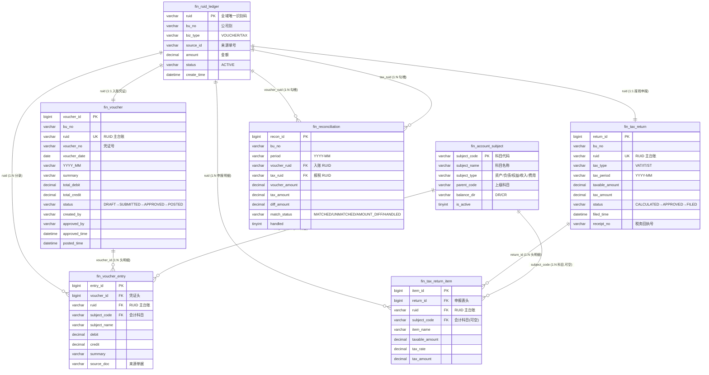
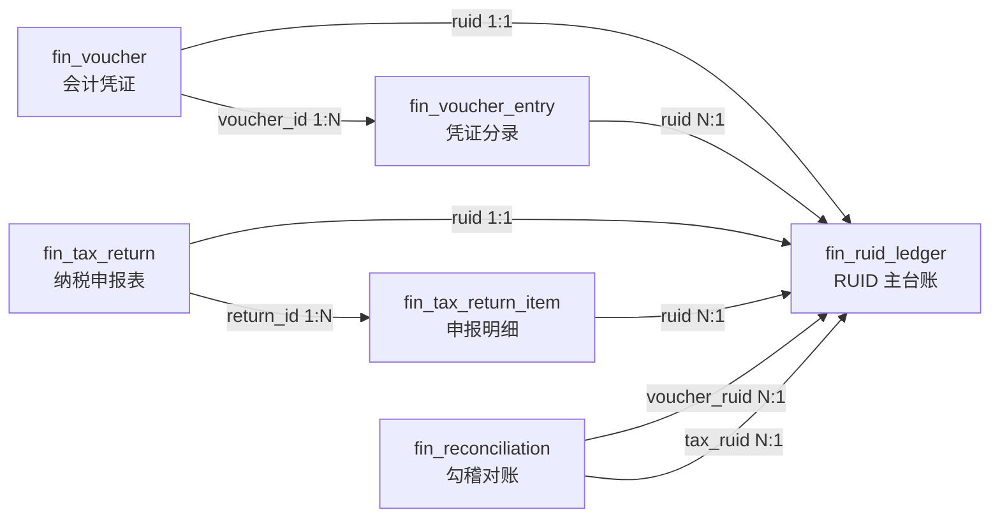

# 财务入账 / 报税 / 勾稽 — 数据表关系结构图

> 对应需求：[财务核心业务流程图.md](财务核心业务流程图.md)
> 迁移脚本：[add_finance_voucher_tax.js](../database/add_finance_voucher_tax.js)
> 共 7 张表，核心设计：**RUID 全链路主键**贯穿入账 → 报税 → 勾稽。

---

## 一、整体关系图（Mermaid ER）

---

## 二、RUID 全链路追溯示意

> **说明**：每笔业务（入账或报税）在建立时产生唯一 RUID，写入 `fin_ruid_ledger`。
> 凭证头、凭证分录、申报表头、申报明细、勾稽记录均通过 RUID 回指主台账，
> 实现「一笔 RUID → 全链路可追溯」。

---

## 三、各表字段详情

### 1. `fin_ruid_ledger` — RUID 主台账

| 字段 | 类型 | 约束 | 说明 |
|---|---|---|---|
| `ruid` | varchar(40) | **PK** | 全域唯一识别码，规则 `R{BU}{yyyymmddHHMMss}{3位随机}` |
| `bu_no` | varchar(20) | NOT NULL, IDX | 公司别 |
| `biz_type` | varchar(20) | NOT NULL | `VOUCHER` 入账 / `TAX` 报税 |
| `source_id` | varchar(50) | IDX | 来源单号（凭证号 / 申报号） |
| `amount` | decimal(18,2) | NOT NULL, DEFAULT 0 | 该笔金额 |
| `status` | varchar(20) | NOT NULL, DEFAULT ACTIVE | 状态 |
| `create_time` | datetime | NOT NULL | 建立时间 |
| `remark` | varchar(500) | | 备注 |

### 2. `fin_account_subject` — 会计科目表

| 字段 | 类型 | 约束 | 说明 |
|---|---|---|---|
| `subject_code` | varchar(20) | **PK** | 科目代码（1001 库存现金…） |
| `subject_name` | varchar(100) | NOT NULL | 科目名称 |
| `subject_type` | varchar(20) | NOT NULL, IDX | 资产/负债/权益/收入/费用 |
| `parent_code` | varchar(20) | | 上级科目代码 |
| `balance_dir` | varchar(3) | NOT NULL, DEFAULT DR | 余额方向 DR/CR |
| `is_active` | tinyint | NOT NULL, DEFAULT 1 | 是否启用 |
| `remark` | varchar(300) | | 备注 |

### 3. `fin_voucher` — 会计凭证（头）

| 字段 | 类型 | 约束 | 说明 |
|---|---|---|---|
| `voucher_id` | bigint | **PK** | 凭证序号 |
| `bu_no` | varchar(20) | NOT NULL, IDX | 公司别 |
| `ruid` | varchar(40) | NOT NULL, **UK** | 关联 RUID 主台账 |
| `voucher_no` | varchar(50) | NOT NULL | 凭证号 `V{BU}{YYYYMM}{4码}` |
| `voucher_date` | date | NOT NULL | 凭证日期 |
| `YYYY_MM` | varchar(10) | NOT NULL | 会计期间 |
| `summary` | varchar(500) | | 摘要 |
| `total_debit` | decimal(18,2) | NOT NULL | 借方合计 |
| `total_credit` | decimal(18,2) | NOT NULL | 贷方合计 |
| `status` | varchar(20) | NOT NULL, IDX | DRAFT→SUBMITTED→APPROVED→REJECTED→**POSTED** |
| `created_by` | varchar(50) | | 建立人 |
| `approved_by` | varchar(50) | | 审核人 |
| `approved_time` | datetime | | 审核时间 |
| `posted_time` | datetime | | 过账时间 |
| `reject_reason` | varchar(500) | | 驳回原因 |

### 4. `fin_voucher_entry` — 凭证分录

| 字段 | 类型 | 约束 | 说明 |
|---|---|---|---|
| `entry_id` | bigint | **PK** | 分录序号 |
| `voucher_id` | bigint | NOT NULL, IDX | **FK→fin_voucher**（1:N） |
| `ruid` | varchar(40) | NOT NULL, IDX | **FK→fin_ruid_ledger** |
| `subject_code` | varchar(20) | NOT NULL, IDX | **FK→fin_account_subject** |
| `subject_name` | varchar(100) | | 科目名称（冗余，便于查询） |
| `debit` | decimal(18,2) | NOT NULL | 借方金额 |
| `credit` | decimal(18,2) | NOT NULL | 贷方金额 |
| `summary` | varchar(300) | | 摘要 |
| `source_doc` | varchar(100) | | 来源单据（发票号/银行回单号） |

### 5. `fin_tax_return` — 纳税申报表（头）

| 字段 | 类型 | 约束 | 说明 |
|---|---|---|---|
| `return_id` | bigint | **PK** | 申报表序号 |
| `bu_no` | varchar(20) | NOT NULL, IDX | 公司别 |
| `ruid` | varchar(40) | NOT NULL, **UK** | 关联 RUID 主台账 |
| `tax_type` | varchar(30) | NOT NULL, IDX | VAT 增值税 / IT 企业所得税 / ST 印花税 |
| `tax_period` | varchar(10) | NOT NULL | 税务期间 YYYY-MM |
| `taxable_amount` | decimal(18,2) | NOT NULL | 应税金额合计 |
| `tax_amount` | decimal(18,2) | NOT NULL | 应纳税额合计 |
| `status` | varchar(20) | NOT NULL | DRAFT→**CALCULATED**→APPROVED→**FILED** |
| `filed_time` | datetime | | 申报时间 |
| `receipt_no` | varchar(100) | | 税务回执号 `RX{BU}{YYYYMM}{6码}` |
| `remark` | varchar(500) | | 备注 |

### 6. `fin_tax_return_item` — 申报明细

| 字段 | 类型 | 约束 | 说明 |
|---|---|---|---|
| `item_id` | bigint | **PK** | 明细序号 |
| `return_id` | bigint | NOT NULL, IDX | **FK→fin_tax_return**（1:N） |
| `ruid` | varchar(40) | NOT NULL, IDX | **FK→fin_ruid_ledger** |
| `subject_code` | varchar(20) | IDX | **FK→fin_account_subject**（可空） |
| `item_name` | varchar(200) | | 项目名称 |
| `taxable_amount` | decimal(18,2) | NOT NULL | 应税金额 |
| `tax_rate` | decimal(10,4) | NOT NULL | 税率 |
| `tax_amount` | decimal(18,2) | NOT NULL | 税额 = 应税 × 税率 |

### 7. `fin_reconciliation` — 勾稽对账

| 字段 | 类型 | 约束 | 说明 |
|---|---|---|---|
| `recon_id` | bigint | **PK** | 勾稽序号 |
| `bu_no` | varchar(20) | NOT NULL, IDX | 公司别 |
| `period` | varchar(10) | NOT NULL | 勾稽期间 YYYY-MM |
| `voucher_ruid` | varchar(40) | | **FK→fin_ruid_ledger**（入账端，可空） |
| `tax_ruid` | varchar(40) | | **FK→fin_ruid_ledger**（报税端，可空） |
| `voucher_amount` | decimal(18,2) | NOT NULL | 入账金额 |
| `tax_amount` | decimal(18,2) | NOT NULL | 报税金额 |
| `diff_amount` | decimal(18,2) | NOT NULL | 差异 = 报税 − 入账 |
| `match_status` | varchar(20) | NOT NULL, IDX | MATCHED / UNMATCHED / AMOUNT_DIFF / HANDLED |
| `handled` | tinyint | NOT NULL, DEFAULT 0 | 是否已人工处理 |
| `remark` | varchar(500) | | 处理说明 |

---

## 四、关系清单（含基数）

| 序号 | 父表 | 子表 | 关联字段 | 基数 | 说明 |
|---|---|---|---|---|---|
| 1 | fin_ruid_ledger | fin_voucher | ruid | 1 : 1 | 一笔入账对应一个 RUID |
| 2 | fin_ruid_ledger | fin_tax_return | ruid | 1 : 1 | 一笔报税对应一个 RUID |
| 3 | fin_ruid_ledger | fin_voucher_entry | ruid | 1 : N | 一个 RUID 可有多条分录 |
| 4 | fin_ruid_ledger | fin_tax_return_item | ruid | 1 : N | 一个 RUID 可有多条申报明细 |
| 5 | fin_ruid_ledger | fin_reconciliation | voucher_ruid | 1 : N | 入账 RUID 可出现在多笔勾稽 |
| 6 | fin_ruid_ledger | fin_reconciliation | tax_ruid | 1 : N | 报税 RUID 可出现在多笔勾稽 |
| 7 | fin_voucher | fin_voucher_entry | voucher_id | 1 : N | 一张凭证多条分录 |
| 8 | fin_tax_return | fin_tax_return_item | return_id | 1 : N | 一张申报表多条明细 |
| 9 | fin_account_subject | fin_voucher_entry | subject_code | 1 : N | 一个科目可被多条分录引用 |
| 10 | fin_account_subject | fin_tax_return_item | subject_code | 1 : N | 一个科目可被多条申报明细引用 |

> **设计重点**：所有关联皆以逻辑外键（字段命名 + 索引）实现，未强制宣告 FOREIGN KEY 约束，
> 以保持与现有 `mgm_*` / `ermm_*` 表风格一致，并便于数据迁移。
> `fin_ruid_ledger` 为全模块的**中枢表**，入账与报税双向均通过它关联，勾稽引擎亦以它为比对锚点。
