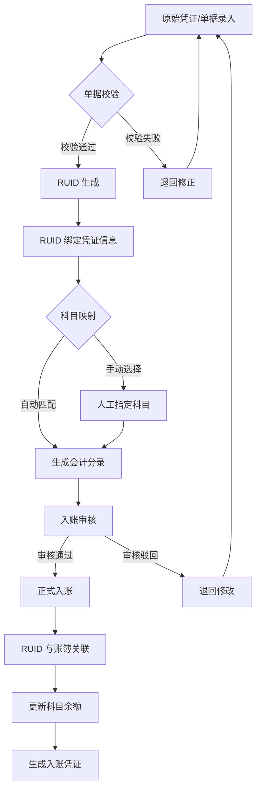
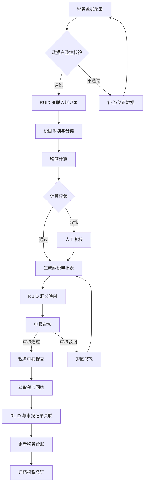
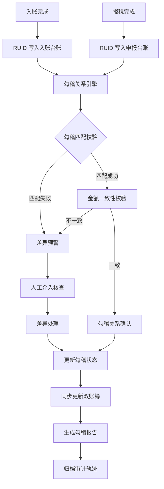

# 财务核心业务流程图

## 一、会计入账功能（含RUID）

### 流程说明

| 步骤 | 说明 |
|------|------|
| 原始凭证录入 | 收集发票、合同、银行回单等原始凭证信息 |
| 单据校验 | 校验凭证完整性、金额准确性、附件齐全性 |
| RUID 生成 | 为每笔业务生成全局唯一标识符（RUID），贯穿后续全流程 |
| 科目映射 | 根据业务类型自动匹配会计科目，支持手动调整 |
| 入账审核 | 审核分录的准确性与合规性 |
| 正式入账 | 审核通过后写入总账/明细账 |
| RUID 与账簿关联 | 将 RUID 绑定至对应账簿记录，实现可追溯 |
| 更新科目余额 | 实时更新各科目余额，保证账实一致 |
| 生成入账凭证 | 输出标准会计凭证供归档与查询 |

---

## 二、报税功能（含RUID）

### 流程说明

| 步骤 | 说明 |
|------|------|
| 税务数据采集 | 从财务系统、业务系统采集增值税、所得税等税种数据 |
| 数据完整性校验 | 校验采集数据的完整性、格式规范性 |
| RUID 关联入账记录 | 通过 RUID 将报税数据与已入账记录精确关联 |
| 税目识别与分类 | 自动识别业务对应的税目、税率 |
| 税额计算 | 按适用税率计算应纳税额 |
| 生成纳税申报表 | 自动生成标准纳税申报表（各税种） |
| RUID 汇总映射 | 将多条入账记录的 RUID 汇总映射至申报明细 |
| 申报审核 | 对申报表进行合规性与准确性审核 |
| 税务申报提交 | 向税务系统提交申报数据 |
| 获取税务回执 | 接收税务系统反馈的申报回执 |
| RUID 与申报记录关联 | 将 RUID 与最终申报记录绑定，实现全链路追溯 |
| 更新税务台账 | 实时更新税务台账，反映最新申报状态 |
| 归档报税凭证 | 归档申报表、回执等凭证资料 |

---

## 三、报税与会计入账的勾稽更新

### 流程说明

| 步骤 | 说明 |
|------|------|
| 入账完成 | 会计入账流程结束后，将 RUID 写入入账台账 |
| 报税完成 | 报税流程结束后，将 RUID 写入申报台账 |
| 勾稽关系引擎 | 基于 RUID 自动建立入账记录与申报记录之间的勾稽关系 |
| 勾稽匹配校验 | 检查每笔入账记录是否有对应的申报记录（反之亦然） |
| 金额一致性校验 | 对匹配成功的记录对，校验入账金额与申报金额是否一致 |
| 差异预警 | 匹配失败或金额不一致时自动触发预警 |
| 人工介入核查 | 对异常记录由财务人员核查原因并处理 |
| 勾稽关系确认 | 校验通过后确认勾稽关系有效 |
| 同步更新双账簿 | 确保入账账簿与税务台账状态同步一致 |
| 生成勾稽报告 | 输出勾稽对账报告，供审计与管理层查阅 |
| 归档审计轨迹 | 完整记录勾稽全过程，满足审计追溯要求 |

---

## 附：RUID 贯穿全链路总览

> **RUID（Record Unique Identifier）** 为每笔业务生成全局唯一标识，贯穿会计入账、报税申报、勾稽对账全流程，实现业务数据的全链路可追溯与跨系统关联。
